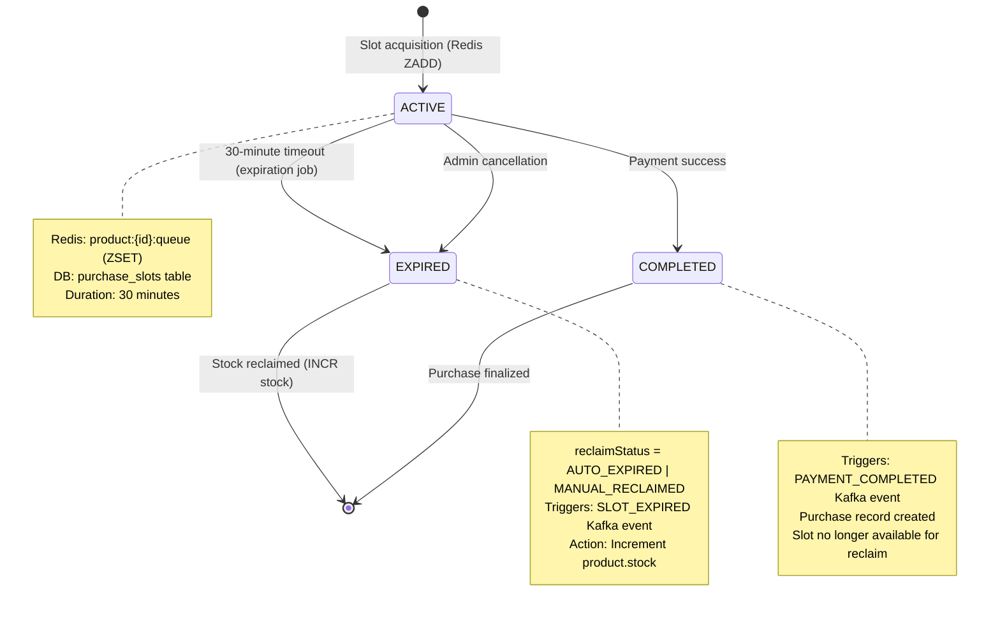
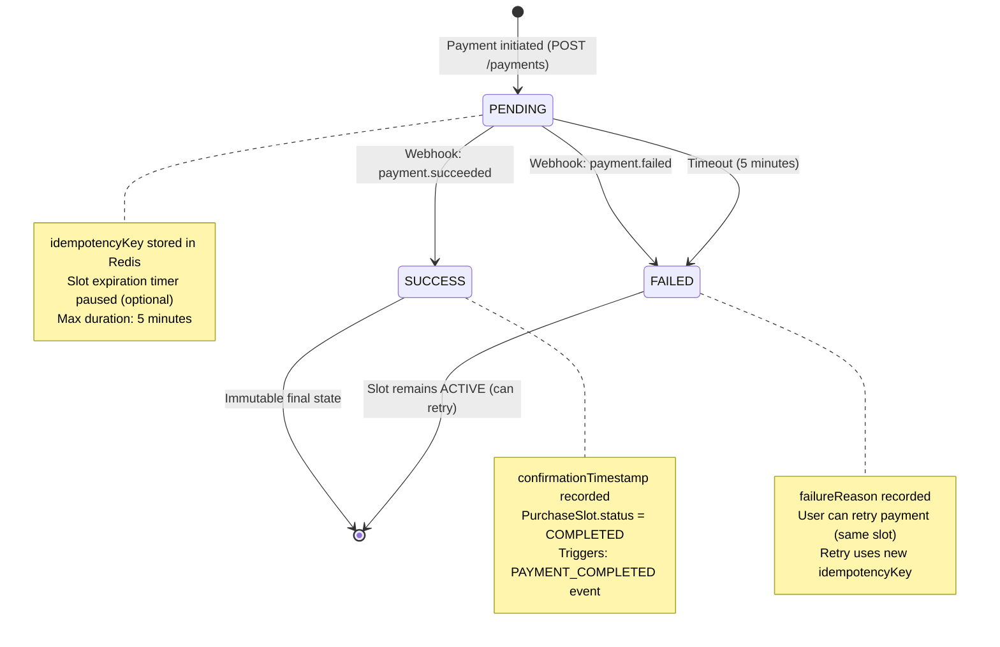

# Data Model: Product Domain

**Feature**: Product Domain API & Business Logic
**Date**: 2026-01-05
**Status**: ✅ COMPLETE

## Overview

This document defines the data model for the Product domain, including entity schemas, relationships, state transitions, and validation rules. The model supports three aggregate roots: Product, PurchaseSlot, and Purchase.

---

## Entity Schemas

### Product (Aggregate Root)

**Purpose**: Represents a purchasable item in the Dopamine Store catalog.

**Attributes**:

| Field | Type | Constraints | Description |
|-------|------|-------------|-------------|
| `id` | UUID | PRIMARY KEY, NOT NULL | Unique product identifier |
| `name` | String | NOT NULL, LENGTH(1-200) | Display name |
| `description` | String | NOT NULL, LENGTH(1-2000) | Detailed description |
| `stock` | Integer | NOT NULL, >= 0 | Total available quantity (includes unsold + active slots) |
| `initialStock` | Integer | NOT NULL, >= 0 | Original stock quantity (immutable after creation) |
| `saleDate` | Timestamp | NOT NULL | When product becomes available for purchase (ISO 8601 with timezone) |
| `status` | Enum | NOT NULL | UPCOMING, ON_SALE, SOLD_OUT (computed field) |
| `createdAt` | Timestamp | NOT NULL, DEFAULT NOW() | Creation timestamp |
| `updatedAt` | Timestamp | NOT NULL, DEFAULT NOW() | Last modification timestamp |
| `createdBy` | UUID | NOT NULL, FK → auth.users | Admin user who created the product |

**Computed Fields**:
- `status`:
  - `UPCOMING`: `current_time < saleDate`
  - `ON_SALE`: `current_time >= saleDate AND stock > 0`
  - `SOLD_OUT`: `stock == 0`

**Indexes**:
- `idx_product_sale_date`: Index on `saleDate` (for listing upcoming/active sales)
- `idx_product_status`: Composite index on `(status, saleDate)` (for filtering)

**Validation Rules**:
- `stock` cannot be decreased below the number of active PurchaseSlots
- `saleDate` cannot be changed if any PurchaseSlots exist (active, expired, or completed)
- `initialStock` is set on creation and never modified

**Invariants**:
- `stock` >= `count(active PurchaseSlots for this product)`
- `initialStock` >= `stock` (stock can only decrease or stay same)

---

### PurchaseSlot (Aggregate Root)

**Purpose**: Represents a temporary right to purchase a product, granted on a first-come-first-served basis.

**Attributes**:

| Field | Type | Constraints | Description |
|-------|------|-------------|-------------|
| `id` | UUID | PRIMARY KEY, NOT NULL | Unique slot identifier |
| `productId` | UUID | NOT NULL, FK → Product | Associated product |
| `userId` | UUID | NOT NULL, FK → auth.users | User who acquired the slot |
| `acquisitionTimestamp` | Timestamp | NOT NULL | When slot was acquired (epoch milliseconds for precision) |
| `expirationTimestamp` | Timestamp | NOT NULL | When slot expires (acquisition + 30 minutes) |
| `status` | Enum | NOT NULL | ACTIVE, EXPIRED, COMPLETED |
| `reclaimStatus` | Enum | NULLABLE | NULL, AUTO_EXPIRED, MANUAL_RECLAIMED (only for EXPIRED status) |
| `createdAt` | Timestamp | NOT NULL, DEFAULT NOW() | Creation timestamp |
| `updatedAt` | Timestamp | NOT NULL, DEFAULT NOW() | Last state transition timestamp |
| `traceId` | String | NOT NULL | Distributed trace ID for debugging |

**Status Transitions**:
```
ACTIVE
  ├──[30 min timeout]──> EXPIRED (reclaimStatus = AUTO_EXPIRED)
  ├──[admin action]────> EXPIRED (reclaimStatus = MANUAL_RECLAIMED)
  └──[payment success]─> COMPLETED
```

**Indexes**:
- `idx_slot_user_product`: Unique composite index on `(userId, productId, status)` WHERE `status = 'ACTIVE'` (enforce one slot per user per product)
- `idx_slot_expiration`: Index on `expirationTimestamp` (for expiration job queries)
- `idx_slot_product_status`: Composite index on `(productId, status)` (for slot counting)

**Validation Rules**:
- `expirationTimestamp` must be exactly 30 minutes after `acquisitionTimestamp`
- `status` can only transition: ACTIVE → EXPIRED or ACTIVE → COMPLETED (no reverting)
- `reclaimStatus` can only be set when `status == EXPIRED`

**Invariants**:
- At most one ACTIVE slot per `(userId, productId)` pair (enforced by unique index)
- `expirationTimestamp` = `acquisitionTimestamp` + 30 minutes
- Sum of ACTIVE slots for a product <= product's `stock`

---

### Purchase (Aggregate Root)

**Purpose**: Represents a completed payment transaction for a PurchaseSlot.

**Attributes**:

| Field | Type | Constraints | Description |
|-------|------|-------------|-------------|
| `id` | UUID | PRIMARY KEY, NOT NULL | Unique purchase identifier |
| `purchaseSlotId` | UUID | NOT NULL, UNIQUE, FK → PurchaseSlot | Associated slot (one-to-one) |
| `userId` | UUID | NOT NULL, FK → auth.users | User who made the purchase |
| `productId` | UUID | NOT NULL, FK → Product | Product being purchased (denormalized for query efficiency) |
| `paymentId` | String | NOT NULL, UNIQUE | External payment gateway reference |
| `idempotencyKey` | UUID | NOT NULL, UNIQUE | For duplicate payment prevention |
| `amount` | Decimal | NOT NULL, PRECISION(10,2) | Payment amount |
| `currency` | String | NOT NULL, LENGTH(3) | ISO 4217 currency code (default: "KRW") |
| `paymentMethod` | Enum | NOT NULL | CARD, BANK_TRANSFER, WALLET (future expansion) |
| `paymentStatus` | Enum | NOT NULL | PENDING, SUCCESS, FAILED |
| `confirmationTimestamp` | Timestamp | NULLABLE | When payment succeeded (NULL if PENDING/FAILED) |
| `failureReason` | String | NULLABLE, LENGTH(0-500) | Error message if FAILED |
| `createdAt` | Timestamp | NOT NULL, DEFAULT NOW() | Initial payment attempt timestamp |
| `updatedAt` | Timestamp | NOT NULL, DEFAULT NOW() | Last status update timestamp |
| `traceId` | String | NOT NULL | Distributed trace ID |

**Status Transitions**:
```
PENDING
  ├──[webhook: payment.succeeded]──> SUCCESS
  └──[webhook: payment.failed]─────> FAILED
```

**Indexes**:
- `idx_purchase_slot`: Unique index on `purchaseSlotId` (one purchase per slot)
- `idx_purchase_idempotency`: Unique index on `idempotencyKey` (prevent duplicate charges)
- `idx_purchase_user_status`: Composite index on `(userId, paymentStatus)` (for user purchase history)

**Validation Rules**:
- `purchaseSlotId` must reference a slot with `status = ACTIVE` (validated at creation)
- `idempotencyKey` must be unique across all purchases
- `confirmationTimestamp` can only be set when `paymentStatus == SUCCESS`
- `failureReason` can only be set when `paymentStatus == FAILED`

**Invariants**:
- Once `paymentStatus == SUCCESS`, it cannot change (immutable confirmation)
- `purchaseSlotId` is unique (one purchase per slot)
- `amount` > 0

---

## Entity Relationships

```
User (Auth Domain)
  │
  ├──1:N──> PurchaseSlot (userId FK)
  │           │
  │           ├── belongs to ──> Product (productId FK)
  │           │
  │           └──1:1 (optional)──> Purchase (purchaseSlotId FK)
  │
  └──1:N──> Purchase (userId FK)


Product
  │
  ├──1:N──> PurchaseSlot (productId FK)
  │
  └──1:N (denormalized)──> Purchase (productId FK)


PurchaseSlot
  │
  ├──1:1 (optional)──> Purchase (purchaseSlotId FK)
  │
  ├── belongs to ──> Product (productId FK)
  │
  └── belongs to ──> User (userId FK)
```

**Cardinality**:
- One User can have many PurchaseSlots (across different products or expired/completed slots for the same product)
- One User can have at most one ACTIVE PurchaseSlot per Product
- One Product can have many PurchaseSlots (up to initialStock count)
- One PurchaseSlot can have at most one Purchase (1:1 optional relationship)

---

## State Machines

### PurchaseSlot State Transitions



**Transition Guards**:
- `ACTIVE → COMPLETED`: Requires `current_time <= expirationTimestamp` AND `paymentStatus == SUCCESS`
- `ACTIVE → EXPIRED`: Requires `current_time > expirationTimestamp` OR admin action
- `EXPIRED → *`: Irreversible; stock already reclaimed

### Purchase Payment Status Transitions



---

## Validation Rules

### Product Validation

**On Creation (`POST /products`)**:
- `name`: 1-200 characters, non-empty
- `description`: 1-2000 characters
- `stock`: > 0 (cannot create product with zero stock)
- `saleDate`: Must be in the future (> current_time + 1 hour minimum)
- `createdBy`: Must be a valid admin user ID (validated via Auth domain)

**On Update (`PUT /products/:id`)**:
- `name`, `description`: Same as creation rules
- `stock`: Can only be increased (never decreased); new stock = old stock + delta
- `saleDate`: **Cannot be changed** if any PurchaseSlots exist (enforced at service layer)
- `initialStock`: **Cannot be changed** (immutable field)

**On Deletion (`DELETE /products/:id`)**:
- **Blocked** if any ACTIVE PurchaseSlots exist
- **Allowed** if only EXPIRED or COMPLETED slots exist (soft delete recommended)

### PurchaseSlot Validation

**On Acquisition (`POST /slots/acquire`)**:
- `userId`: Must be authenticated user ID (from JWT)
- `productId`: Must reference existing product with `status = ON_SALE`
- **Duplicate Check**: No existing ACTIVE slot for `(userId, productId)`
- **Stock Check**: `product.stock > 0` (atomic check in Redis)
- **Arrival Time**: Timestamp recorded with millisecond precision

**On Expiration (Scheduled Job)**:
- `current_time > expirationTimestamp`: Slot qualifies for expiration
- **Idempotency**: Job must handle already-expired slots gracefully (check status before transition)

### Purchase Validation

**On Payment Initiation (`POST /payments`)**:
- `purchaseSlotId`: Must reference existing slot with `status = ACTIVE`
- **Expiration Check**: `current_time <= slot.expirationTimestamp`
- `idempotencyKey`: Must be unique (checked in Redis before DB insert)
- `amount`: Must match product price (enforced at service layer)

**On Payment Webhook (`POST /webhooks/payment`)**:
- `paymentId`: Must reference existing pending purchase
- **Signature Verification**: HMAC validation of webhook payload
- **Idempotency**: Webhook retries must be handled (same paymentId = same result)

---

## Database Schema (PostgreSQL)

```sql
-- Products table
CREATE TABLE products (
    id UUID PRIMARY KEY DEFAULT gen_random_uuid(),
    name VARCHAR(200) NOT NULL,
    description VARCHAR(2000) NOT NULL,
    stock INTEGER NOT NULL CHECK (stock >= 0),
    initial_stock INTEGER NOT NULL CHECK (initial_stock >= 0),
    sale_date TIMESTAMP WITH TIME ZONE NOT NULL,
    created_at TIMESTAMP WITH TIME ZONE NOT NULL DEFAULT NOW(),
    updated_at TIMESTAMP WITH TIME ZONE NOT NULL DEFAULT NOW(),
    created_by UUID NOT NULL, -- FK to auth.users (external domain)

    CONSTRAINT stock_not_negative CHECK (stock >= 0),
    CONSTRAINT initial_stock_immutable CHECK (stock <= initial_stock)
);

CREATE INDEX idx_product_sale_date ON products(sale_date);
CREATE INDEX idx_product_status_date ON products(sale_date, stock);  -- For status queries

-- Purchase Slots table
CREATE TABLE purchase_slots (
    id UUID PRIMARY KEY DEFAULT gen_random_uuid(),
    product_id UUID NOT NULL REFERENCES products(id) ON DELETE RESTRICT,
    user_id UUID NOT NULL,  -- FK to auth.users (external domain)
    acquisition_timestamp TIMESTAMP WITH TIME ZONE NOT NULL,
    expiration_timestamp TIMESTAMP WITH TIME ZONE NOT NULL,
    status VARCHAR(20) NOT NULL CHECK (status IN ('ACTIVE', 'EXPIRED', 'COMPLETED')),
    reclaim_status VARCHAR(30) CHECK (reclaim_status IN ('AUTO_EXPIRED', 'MANUAL_RECLAIMED')),
    created_at TIMESTAMP WITH TIME ZONE NOT NULL DEFAULT NOW(),
    updated_at TIMESTAMP WITH TIME ZONE NOT NULL DEFAULT NOW(),
    trace_id VARCHAR(100) NOT NULL,

    CONSTRAINT expiration_30min CHECK (
        expiration_timestamp = acquisition_timestamp + INTERVAL '30 minutes'
    ),
    CONSTRAINT reclaim_only_when_expired CHECK (
        (status = 'EXPIRED' AND reclaim_status IS NOT NULL) OR
        (status != 'EXPIRED' AND reclaim_status IS NULL)
    )
);

CREATE UNIQUE INDEX idx_slot_user_product_active
    ON purchase_slots(user_id, product_id)
    WHERE status = 'ACTIVE';  -- One active slot per user per product

CREATE INDEX idx_slot_expiration ON purchase_slots(expiration_timestamp)
    WHERE status = 'ACTIVE';  -- For expiration job

CREATE INDEX idx_slot_product_status ON purchase_slots(product_id, status);

-- Purchases table
CREATE TABLE purchases (
    id UUID PRIMARY KEY DEFAULT gen_random_uuid(),
    purchase_slot_id UUID NOT NULL UNIQUE REFERENCES purchase_slots(id) ON DELETE RESTRICT,
    user_id UUID NOT NULL,  -- FK to auth.users
    product_id UUID NOT NULL REFERENCES products(id) ON DELETE RESTRICT,  -- Denormalized
    payment_id VARCHAR(100) NOT NULL UNIQUE,
    idempotency_key UUID NOT NULL UNIQUE,
    amount DECIMAL(10, 2) NOT NULL CHECK (amount > 0),
    currency CHAR(3) NOT NULL DEFAULT 'KRW',
    payment_method VARCHAR(20) NOT NULL CHECK (payment_method IN ('CARD', 'BANK_TRANSFER', 'WALLET')),
    payment_status VARCHAR(20) NOT NULL CHECK (payment_status IN ('PENDING', 'SUCCESS', 'FAILED')),
    confirmation_timestamp TIMESTAMP WITH TIME ZONE,
    failure_reason VARCHAR(500),
    created_at TIMESTAMP WITH TIME ZONE NOT NULL DEFAULT NOW(),
    updated_at TIMESTAMP WITH TIME ZONE NOT NULL DEFAULT NOW(),
    trace_id VARCHAR(100) NOT NULL,

    CONSTRAINT confirmation_only_on_success CHECK (
        (payment_status = 'SUCCESS' AND confirmation_timestamp IS NOT NULL) OR
        (payment_status != 'SUCCESS' AND confirmation_timestamp IS NULL)
    ),
    CONSTRAINT failure_reason_only_on_failed CHECK (
        (payment_status = 'FAILED' AND failure_reason IS NOT NULL) OR
        (payment_status != 'FAILED' AND failure_reason IS NULL)
    )
);

CREATE INDEX idx_purchase_user_status ON purchases(user_id, payment_status);
CREATE INDEX idx_purchase_created_at ON purchases(created_at DESC);  -- For recent purchases

-- Audit log table (for slot state transitions)
CREATE TABLE slot_audit_log (
    id UUID PRIMARY KEY DEFAULT gen_random_uuid(),
    slot_id UUID NOT NULL REFERENCES purchase_slots(id),
    event_type VARCHAR(50) NOT NULL,  -- SLOT_REQUESTED, SLOT_ACQUIRED, SLOT_EXPIRED, etc.
    old_status VARCHAR(20),
    new_status VARCHAR(20) NOT NULL,
    timestamp TIMESTAMP WITH TIME ZONE NOT NULL DEFAULT NOW(),
    trace_id VARCHAR(100) NOT NULL,
    metadata JSONB  -- Additional context (e.g., expiration reason, admin action)
);

CREATE INDEX idx_audit_slot ON slot_audit_log(slot_id, timestamp DESC);
CREATE INDEX idx_audit_timestamp ON slot_audit_log(timestamp DESC);
```

---

## Redis Data Structures

### Slot Availability (Fairness Queue)

**Key**: `product:{productId}:queue`
**Type**: Sorted Set (ZSET)
**Score**: Arrival timestamp (epoch milliseconds)
**Value**: `userId`

**Operations**:
```redis
# Acquire slot (Lua script)
EVAL "slot-acquisition.lua" 3
    "product:123:stock"
    "product:123:queue"
    "user:456:product:123"
    "456" "1704499200000"

# Check queue position
ZRANK product:123:queue 456  # Returns 0-based position

# Pop next user (for testing)
ZPOPMIN product:123:queue 1
```

### Stock Counter

**Key**: `product:{productId}:stock`
**Type**: String (Integer)
**Value**: Current available stock count

**Operations**:
```redis
# Initialize on product creation
SET product:123:stock 100

# Atomic decrement on slot acquisition
DECR product:123:stock

# Atomic increment on slot expiration
INCR product:123:stock
```

### Duplicate Prevention

**Key**: `user:{userId}:product:{productId}`
**Type**: String (flag)
**Value**: `"1"` (presence check only)
**TTL**: 1800 seconds (30 minutes)

**Operations**:
```redis
# Check existence
EXISTS user:456:product:123  # Returns 0 (not exists) or 1 (exists)

# Set with expiry (during slot acquisition)
SET user:456:product:123 "1" EX 1800
```

### Idempotency Keys (Payment)

**Key**: `payment:idempotency:{idempotencyKey}`
**Type**: String (paymentId)
**Value**: Payment ID (UUID)
**TTL**: 86400 seconds (24 hours)

**Operations**:
```redis
# Check + set
GET payment:idempotency:abc-123  # Returns NULL or paymentId
SET payment:idempotency:abc-123 "payment-xyz" EX 86400
```

---

## Data Consistency Guarantees

### Eventual Consistency (Async Writes)

**PostgreSQL ← Kafka ← Redis**: Slot acquisitions are written to Redis first (low latency), then asynchronously persisted to PostgreSQL via Kafka events.

**Trade-off**: Redis is source of truth for stock availability (critical path); PostgreSQL is eventual source of truth for audit trail.

**Recovery**: On Redis failure, rebuild state from PostgreSQL `purchase_slots` table (filter `status = ACTIVE`).

### Strong Consistency (Atomic Operations)

**Slot Acquisition**: Lua script ensures atomicity of:
1. Check duplicate
2. Check stock
3. Decrement stock
4. Add to queue
5. Set duplicate flag

**Slot Expiration**: Transaction ensures atomicity of:
1. Update slot status → EXPIRED
2. Increment product stock
3. Insert audit log

---

## Migration Strategy

### Phase 1: Initial Schema

Create tables in order:
1. `products` (no dependencies)
2. `purchase_slots` (depends on products)
3. `purchases` (depends on purchase_slots, products)
4. `slot_audit_log` (depends on purchase_slots)

### Phase 2: Seed Data (Test)

Insert test data:
- 5 products (1 UPCOMING, 2 ON_SALE, 2 SOLD_OUT)
- 100 ACTIVE slots (distributed across products)
- 50 EXPIRED slots (for expiration job testing)
- 20 purchases (10 SUCCESS, 10 PENDING)

### Phase 3: Redis Initialization

On application startup:
- Scan `purchase_slots` WHERE `status = 'ACTIVE'`
- For each product, compute `activeSlotCount`
- Initialize Redis: `SET product:{id}:stock (product.stock - activeSlotCount)`

---

**Document Version**: 1.0
**Last Updated**: 2026-01-05
**Next Steps**: Generate API contracts (openapi.yaml) and Kafka event schemas (Avro)
